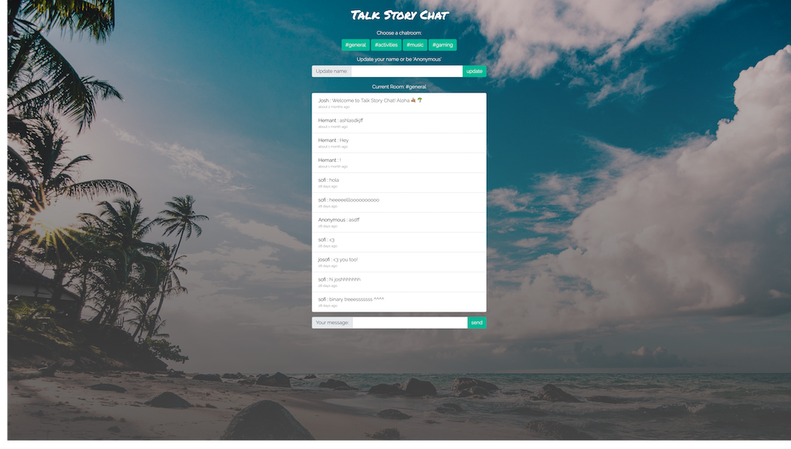

# Talk Story Chat

> Running Live at: https://talkstorychatroom.firebaseapp.com/

---

## What is it?

Talk Story Chat is a chat room app that allows users to communicate with each other in real-time via the chatroom. Currently there are multiple rooms that users can participate in based around certain themes. Also, the first time a users joins the chatroom they are "Anonymous" by default and have the ability to "Update" their name if they choose to do so.

---

## Features

Talk Story Chat features include dynamically/asynchronously delivered content based on user input. This includes dynamically rendered chat messages, the ability to utilize emojis as well as symbols in chat, the ability to Update your User Name, conversation persistence, timestamping according to when a message was sent, as well as the ability to change chatrooms.

### Built with:

- HTML5
- CSS3
- JavaScript
- Firebase Hosting

### Implemented Functional Features:

- [x] Update user name
- [x] Change Chatroom
- [x] Send Real-Time message to board
- [x] Chat persistence

### Roadmap for Development:

- [ ] User Login/OAuth
- [ ] User based permissions
- [ ] Private Chatrooms
- [ ] The ability for any user to create/delete a room
- [ ] The ability for room "owner" to delete messages
- [ ] Multi Media embedding support
- [ ] Friend Lists
- [ ] Favorites Lists

---

## ScreenShots

- Main UI:  
  

---

## Author

- Joshua Jimenez, [Personal Site](https://bigjoshcodes.dev) | [Github: jsjimenez51](https://github.com/jsjimenez51) | [Twitter: @bigjoshcodes](https://twitter.com/bigjoshcodes)
